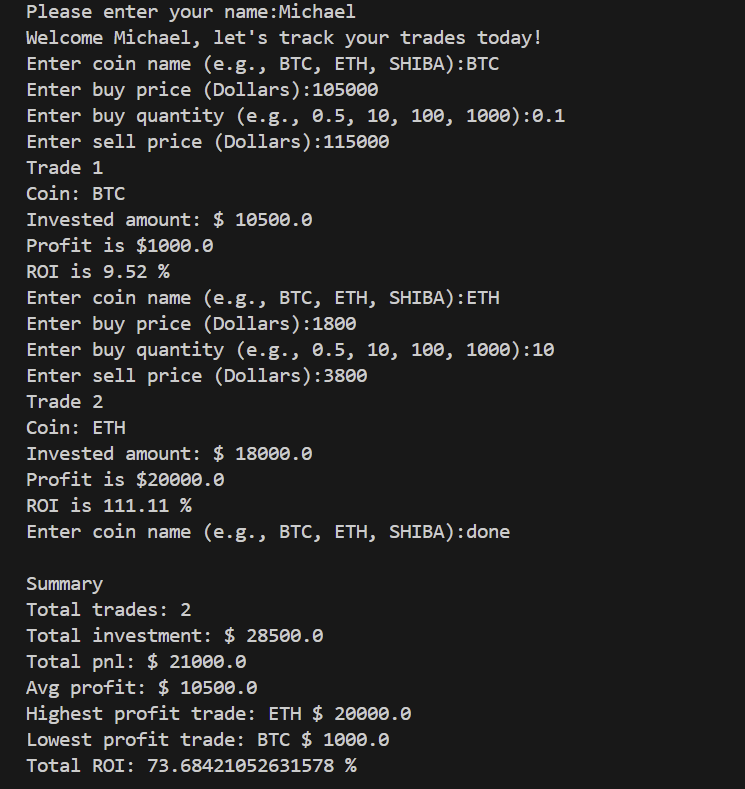

# 🧠 Crypto Trade Tracker — Python CLI Tool

A command-line Python tool to log crypto trades, calculate ROI, and track performance.

---

## 📌 Features

* Track each trade:

  * Coin name
  * Buy price
  * Sell price
  * Quantity
* Calculates:
  * Profit or Loss
  * ROI (%)
    
* Summarizes across all trades:
  * Total trades
  * Total investment
  * Total profit/loss
  * Highest/lowest profit trade
  * Average profit
  * Total ROI
    
* Handles invalid inputs using `try/except`

---

## 🚀 How to Run This Tool

> Run this tool using Python 3 from your terminal

### Step-by-step:

1. **Install Python** (if not already installed)
   Download from: [https://www.python.org/downloads/](https://www.python.org/downloads/)

2. **Download this project:**

```
git clone https://github.com/Auron-zero2dev/crypto-trade-tracker.git
cd crypto-trade-tracker
```

Or download the ZIP from the GitHub repo and extract it.

3. **Run the script:**

```
python crypto-trade-tracker.py
```

The tool will ask for trade details and calculate profit, ROI, and a summary.

---

## 🛠️ How to Use It

Once you run the script, the tool will:
1. Ask for your name
2. Let you enter multiple trades
3. Calculate profit/loss and ROI
4. Show a full trade summary at the end (Only once you type 'done' as a coin name).

---

## 📸 Screenshot



---

## 🎓 Learning Journey

This is my first real-world Python CLI project,
built while learning from the [Python for Everybody](https://www.coursera.org/specializations/python) course.
This is not from the course exercises — I built this independently to test and apply what I’ve learned.

---

## ☕ Support My Journey

If you found this useful and want to support (Tip Jar):

* **Solana (SOL):** 2qvYsGy8Vw9VoGxuPkgk1fGq162hv9nVhGBTVjo6QbQK
* **EVM Wallet:** 0xF5DBb1F15539391ab119fa47387

---

## 📫 Follow Me on 𝕏

- 𝕏 [@auron_zero2dev](https://x.com/auron_zero2dev)
- 🤠 Building tools for degens, by a degen

